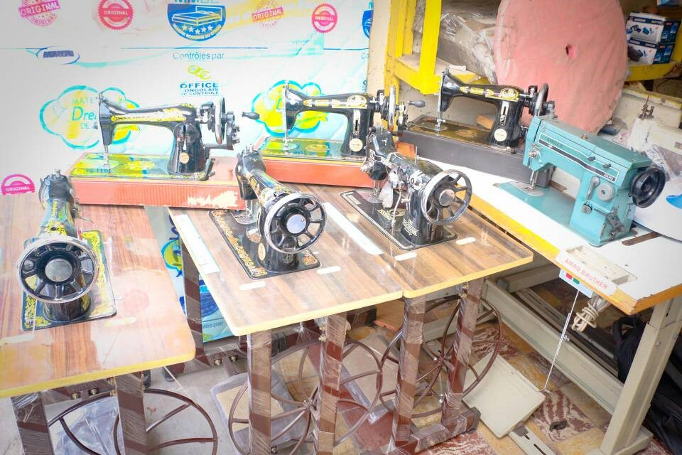

**Avec le soutien du Fond Mécénat SIG (Genève)**
> « L'éducation ne se borne pas à l'enfance et à l'adolescence. L'enseignement ne se limite pas à l'école. Toute la vie, notre milieu est notre éducation, et un éducateur à la fois sévère et dangereux » Paul Valéry.

En 2016, l’association Palmier a fait de cet adage son cheval de bataille en promouvant l’éducation et la formation professionnelle des filles-mères. La formation à un métier est une piste sur laquelle Palmier œuvre pour la valorisation de la femme et son autonomie financière. La promotion du genre est un des objectifs du développement durable en particulier l’objectif 5 : Parvenir à l’égalité des sexes et autonomiser toutes les femmes et les filles.

En partenariat avec l’Association Chrétienne Pour la Promotion du Développement Intégré, en sigle « ACPDI », celle-ci travaille dans l’encadrement des filles-mères au travers du centre de coupe et couture dans la commune de Kabondo, ville de Boma, Kongo-central, R.D.Congo.

Au vu de la situation politique, économique de la R.D.Congo et en particulier la ville de Boma caractérisé par le manque des structures étatiques adéquates, les filles-mères en rupture scolaire ne disposent pas de seconde chance. Les décrochages de filles-mères ont des conséquences sur leurs vies et la vie de leurs enfants. Malgré la bonne volonté de ces filles-mères, il existe très peu de structures pouvant venir en aide à ces filles-mères. C’est pourquoi, l’association Palmier vient au soutien de l’ACPDI dans la mise en place du second centre de formation de coupe et couture plus des cours de français et calcul. Ce centre présente des nombreux avantages dans la prise en charge formative, le soutien psychologique et le suivi des filles-mères. Le plus de ce projet consiste à la formation des filles-mères en Français et calcul dans le but de les préparer leur intégration future.

#### **Le Centre de coupe et Couture (Ville de Boma)**
L’association Palmier a soutenu l’Association Chrétienne Pour la Promotion du Développement Intégré au travers d’un appui matériel et de la formation des formateurs grâce au fond Mécénat de SIG de Genève.
Ce financement a permis l’acquisition des machines (électriques et manuelles), des matériels (fils, mannequins, ciseaux, aiguilles, fers des repassages, tables de repassage) et autres. La formation des formateurs (maîtres) a été aussi un plus dans ce projet les formateurs car ceux-ci seront chargés de la formation en français et calcul.
